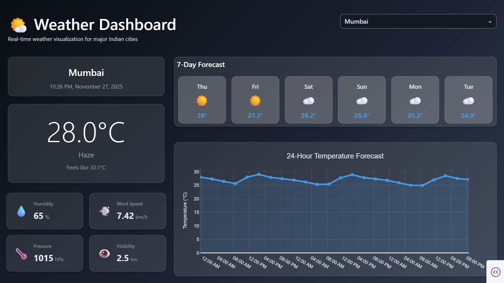

# 🌤️ India Weather Dashboard  
**Task 1 – CODTECH Internship | API Integration & Data Visualization**

---

### **COMPANY:** CODTECH IT SOLUTIONS  
### **NAME:** AMAN SHAIKH  
### **INTERN ID:** CT06DR1460  
### **DOMAIN:** Python Programming  
### **DURATION:** 6 Weeks  
### **MENTOR:** Neela Santhosh Kumar  

---

### 🚀 Live Preview

<p align="center">
  
</p>

---

A visually engaging, **real-time Weather Visualization Dashboard** built with **Python, Dash, and Plotly**.

- Fetches live weather data for Indian cities from the **OpenWeatherMap API**
- Displays **interactive charts**, **dynamic UI**, and **modern glassmorphism styling**
- Fulfills **Task 1 – API Integration & Data Visualization** (CODTECH Internship)

---

## ✨ Features

- **Real-Time Weather Data:** Up-to-date weather for major Indian cities
- **Interactive Plotly Charts:** 24-hour temperature line chart with hover tooltips and smooth animations
- **7-Day Weather Forecast:** Dynamic forecast cards with temperature, weather icons & descriptions
- **Weather Metric Cards:** Glass-style UI for humidity, wind speed, pressure, and visibility

---

## 🛠️ Tech Stack

- Python  
- Dash Framework  
- Plotly  
- Dash Bootstrap Components  
- Pandas  
- OpenWeatherMap API  
- Pytz  

---

## 📁 Project Structure

```
weather-dashboard/
│── weather_dashboard.py
│── requirements.txt
│── README.md
```

---

# ⚙️ Setup Instructions

Follow these steps to set up and run the Weather Dashboard locally:

### 1. **Clone the repository**
```bash
git clone https://github.com/amaanshaikh711/Weather-Forecast-Dashboard.git
cd Weather-Forecast-Dashboard
```

### 2. **Install dependencies**
It’s recommended to use a virtual environment:
```bash
pip install -r requirements.txt
```
Or, install packages directly:
```bash
pip install dash dash-bootstrap-components plotly requests pandas pytz
```

### 3. **Obtain OpenWeatherMap API Key**
- Register at [OpenWeatherMap](https://openweathermap.org/api) and get a free API key.
- Add your API key as an environment variable or configure it inside `weather_dashboard.py` as instructed in the code.

### 4. **Run the application**
```bash
python weather_dashboard.py
```

### 5. **Open in browser**
Navigate to: [http://127.0.0.1:8050/](http://127.0.0.1:8050/)

---

Enjoy exploring real-time weather data with interactive visualizations and elegant design!  
Feel free to contribute or suggest improvements.

---
```
